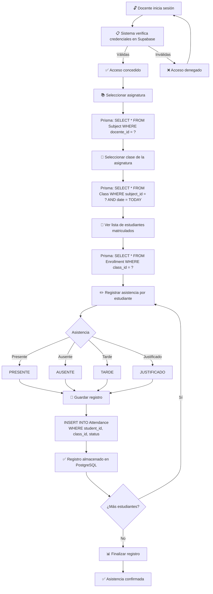
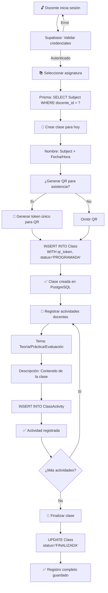
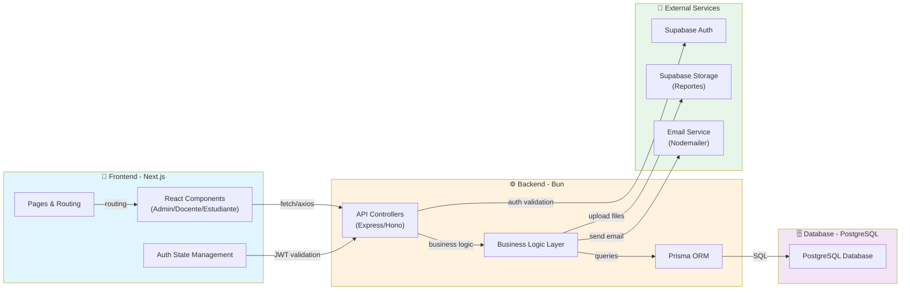
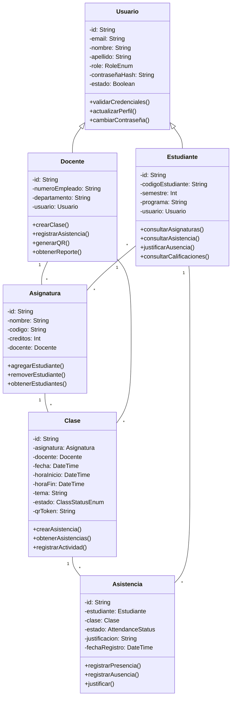

# Documentación Técnica - Sistema de Gestión Académica

**Versión:** 1.0
**Fecha de creación:** 2026-03-13
**Proyecto:** Sistema Integral de Registro Académico y Control de Asistencia

---

## 1. Requerimientos Funcionales

| HU | Código | Nombre del requerimiento | Descripción | Prioridad |
|---|---|---|---|---|
| 1 | RF-ADM-001 | Gestión de docentes | El administrador puede crear, editar y eliminar docentes en el sistema | Alta |
| 2 | RF-ADM-002 | Gestión de estudiantes | El administrador puede crear, editar y eliminar estudiantes en el sistema | Alta |
| 3 | RF-ADM-003 | Gestión de asignaturas | El administrador puede crear, editar y eliminar asignaturas del catálogo | Alta |
| 4 | RF-ADM-004 | Asignación de estudiantes | El administrador puede asignar estudiantes a asignaturas específicas | Alta |
| 5 | RF-ADM-005 | Consulta de reportes | El administrador puede consultar reportes de asistencia y desempeño académico | Media |
| 6 | RF-DOC-001 | Registro de clases | El docente puede registrar clases dictadas para sus asignaturas | Alta |
| 7 | RF-DOC-002 | Registro de asistencia manual | El docente puede registrar la asistencia de estudiantes de forma manual | Alta |
| 8 | RF-DOC-003 | Control de asistencia por QR | El docente puede generar códigos QR para control automático de asistencia | Alta |
| 9 | RF-DOC-004 | Gestión de actividades docentes | El docente puede registrar actividades realizadas durante las clases | Media |
| 10 | RF-DOC-005 | Consulta de asignaturas | El docente puede consultar sus asignaturas asignadas y los estudiantes matriculados | Alta |
| 11 | RF-DOC-006 | Generación de reportes | El docente puede generar reportes de asistencia y actividades de sus asignaturas | Media |
| 12 | RF-EST-001 | Consulta de asistencia | El estudiante puede consultar su registro de asistencia por asignatura | Alta |
| 13 | RF-EST-002 | Consulta de asignaturas | El estudiante puede consultar las asignaturas en las que está matriculado | Alta |
| 14 | RF-EST-003 | Consulta de calificaciones | El estudiante puede consultar sus calificaciones por asignatura | Media |
| 15 | RF-EST-004 | Justificación de ausencias | El estudiante puede solicitar justificación de ausencias | Media |

---

## 2. Atributos de Calidad

| Atributo | Justificación en el contexto del proyecto | Razón para no priorizar otros atributos |
|---|---|---|
| **Seguridad** | Crítica en contexto académico: protege datos estudiantiles, registros de asistencia y calificaciones. Requiere autenticación robusta y control de acceso basado en roles (RBAC). | Otros atributos son secundarios si no hay seguridad: sin ella, los datos académicos pueden ser manipulados. |
| **Disponibilidad** | El sistema debe estar disponible durante horarios de clases para registro de asistencia. Downtime afecta directamente la operación diaria. | No es crítica 24/7 si se planifica mantenimiento fuera de horarios de clase. |
| **Escalabilidad** | Debe crecer desde 100 hasta 10,000+ estudiantes sin degradación de rendimiento en registros de asistencia. | La arquitectura en capas (Bun + PostgreSQL) lo permite; inversión inicial modesta. |
| **Mantenibilidad** | El código debe ser legible y documentado para permitir que otros desarrolladores entiendan la lógica de negocio académica. | Facilita agregar nuevas funcionalidades (justificaciones, reportes complejos) sin deuda técnica. |
| **Usabilidad** | Docentes y estudiantes tienen diferentes niveles técnicos; la interfaz debe ser intuitiva para uso rápido (ej: marcar asistencia en <30 segundos). | Un sistema complejo desalienta adoption; la usabilidad impacta la calidad de los datos registrados. |
| **Rendimiento** | Registro de asistencia por QR debe ser <2 segundos. Consultas de reportes <5 segundos. | La latencia afecta la experiencia del docente en clase; reportes lentos desalientan su uso. |

---

## 3. Diagramas de Flujo

### 3.1 Control Manual de Asistencia Estudiantil



### 3.2 Registro de Clase y Labor Docente



---

## 4. Arquitectura del Sistema

### 4.1 Capa de Presentación (Frontend)

**Tecnología:** Next.js 16 (React 19, TypeScript, Tailwind CSS)

**Responsabilidades:**
- Interfaz de usuario responsiva para tres roles distintos (Admin, Docente, Estudiante)
- Validación de formularios en cliente
- Renderizado de datos y reportes
- Comunicación con API Backend mediante fetch/axios
- Manejo de sesiones y redirecciones basadas en roles
- Almacenamiento local de preferencias de usuario

**Componentes principales:**
```
pages/
  ├── admin/
  │   ├── dashboard
  │   ├── docentes
  │   ├── estudiantes
  │   └── asignaturas
  ├── docente/
  │   ├── dashboard
  │   ├── mis-asignaturas
  │   ├── registro-asistencia
  │   └── reportes
  └── estudiante/
      ├── dashboard
      ├── mis-asignaturas
      └── mi-asistencia
```

---

### 4.2 Capa de Aplicación (Backend)

**Tecnología:** Bun Runtime + TypeScript

**Responsabilidades:**
- Procesar solicitudes HTTP de la capa de presentación
- Validar permisos y roles de usuarios
- Orquestar llamadas a la capa de lógica de negocio
- Retornar respuestas JSON estructuradas

#### Endpoints del Sistema

##### **Endpoints de Administrador**

| HTTP | Endpoint | Descripción |
|---|---|---|
| POST | `/api/admin/docentes` | Crear un nuevo docente |
| GET | `/api/admin/docentes` | Listar todos los docentes |
| PUT | `/api/admin/docentes/:id` | Actualizar datos de docente |
| DELETE | `/api/admin/docentes/:id` | Eliminar un docente |
| POST | `/api/admin/estudiantes` | Crear un nuevo estudiante |
| GET | `/api/admin/estudiantes` | Listar todos los estudiantes |
| PUT | `/api/admin/estudiantes/:id` | Actualizar datos de estudiante |
| DELETE | `/api/admin/estudiantes/:id` | Eliminar un estudiante |
| POST | `/api/admin/asignaturas` | Crear una nueva asignatura |
| GET | `/api/admin/asignaturas` | Listar todas las asignaturas |
| PUT | `/api/admin/asignaturas/:id` | Actualizar asignatura |
| DELETE | `/api/admin/asignaturas/:id` | Eliminar asignatura |
| POST | `/api/admin/asignaturas/:id/estudiantes` | Asignar estudiante a asignatura |
| DELETE | `/api/admin/asignaturas/:id/estudiantes/:estudiante_id` | Desasignar estudiante |
| GET | `/api/admin/reportes/asistencia` | Obtener reportes de asistencia global |
| GET | `/api/admin/reportes/desempeño` | Obtener reportes de desempeño académico |

##### **Endpoints de Docente**

| HTTP | Endpoint | Descripción |
|---|---|---|
| GET | `/api/docente/asignaturas` | Listar asignaturas asignadas al docente |
| GET | `/api/docente/asignaturas/:id` | Obtener detalles de una asignatura |
| GET | `/api/docente/asignaturas/:id/estudiantes` | Listar estudiantes de una asignatura |
| POST | `/api/docente/clases` | Crear una nueva clase |
| GET | `/api/docente/clases` | Listar clases del docente |
| PUT | `/api/docente/clases/:id` | Actualizar datos de clase |
| POST | `/api/docente/clases/:id/generar-qr` | Generar código QR para asistencia |
| POST | `/api/docente/clases/:id/asistencia/manual` | Registrar asistencia manual |
| POST | `/api/docente/clases/:id/actividades` | Registrar actividad docente |
| GET | `/api/docente/clases/:id/actividades` | Listar actividades de una clase |
| PUT | `/api/docente/clases/:id` | Finalizar clase |
| GET | `/api/docente/reportes/asistencia` | Obtener reportes de asistencia por asignatura |
| GET | `/api/docente/reportes/actividades` | Obtener reportes de actividades realizadas |

##### **Endpoints de Estudiante**

| HTTP | Endpoint | Descripción |
|---|---|---|
| GET | `/api/estudiante/dashboard` | Obtener resumen del estudiante |
| GET | `/api/estudiante/asignaturas` | Listar asignaturas matriculadas |
| GET | `/api/estudiante/asignaturas/:id` | Obtener detalles de una asignatura |
| GET | `/api/estudiante/asistencia` | Obtener registro de asistencia |
| GET | `/api/estudiante/asistencia/:asignatura_id` | Obtener asistencia por asignatura |
| POST | `/api/estudiante/asistencia/:id/justificar` | Solicitar justificación de ausencia |
| POST | `/api/estudiante/asistencia/qr` | Registrar asistencia mediante QR |
| GET | `/api/estudiante/calificaciones` | Obtener calificaciones |

##### **Endpoints de Autenticación**

| HTTP | Endpoint | Descripción |
|---|---|---|
| POST | `/api/auth/login` | Iniciar sesión con email y contraseña |
| POST | `/api/auth/logout` | Cerrar sesión |
| POST | `/api/auth/refresh-token` | Renovar token JWT |
| POST | `/api/auth/recuperar-contraseña` | Solicitar recuperación de contraseña |
| POST | `/api/auth/resetear-contraseña` | Resetear contraseña con token |

---

### 4.3 Capa de Lógica de Negocio

**Responsabilidades:**
- Implementar reglas de negocio académicas
- Validar restricciones y constraints
- Calcular métricas de asistencia y desempeño
- Coordinar transacciones complejas
- Gestionar estado de entidades

#### Reglas de Negocio

| Código | Regla de negocio |
|---|---|
| RN-01 | Un estudiante solo puede registrar asistencia en asignaturas donde está matriculado. |
| RN-02 | Un docente solo puede gestionar asignaturas asignadas a él. |
| RN-03 | La asistencia solo se puede registrar para clases creadas y en estado no finalizado. |
| RN-04 | Un token QR es válido solo durante la clase (válido por 60 minutos desde su generación). |
| RN-05 | Un estudiante no puede justificar ausencias después de 7 días de la clase. |
| RN-06 | Solo administradores pueden crear y eliminar usuarios. |
| RN-07 | La asistencia no puede ser modificada después de 24 horas de finalizada la clase. |
| RN-08 | Un estudiante en estado inactivo no puede acceder al sistema. |
| RN-09 | El reporte de asistencia debe reflejar: total clases, presentes, ausentes, tardanzas y justificados. |
| RN-10 | Un docente puede generar solo un QR válido por clase a la vez. |

#### Flujos de Procesos de Lógica de Negocio

##### **Flujo Administrador: Crear y Asignar Usuarios**

```
1. Admin entra a módulo de Gestión de Usuarios
2. Valida permisos (Solo ADMIN puede crear usuarios)
3. Ingresa datos del usuario (nombre, email, rol)
4. Sistema valida:
   - Email único en BD
   - Rol válido (ADMIN | DOCENTE | ESTUDIANTE)
   - Contraseña cumple política
5. Hash contraseña con bcrypt/scrypt
6. Crear usuario en BD con estado activo
7. Generar contraseña temporal
8. Enviar email de bienvenida con credenciales
9. Registrar auditoría de creación
10. Retornar confirmación al admin
```

##### **Flujo Docente: Registrar Asistencia**

```
1. Docente selecciona asignatura de su lista
2. Sistema valida que asignatura pertenece al docente (RN-02)
3. Docente selecciona clase de hoy o fecha específica
4. Sistema carga lista de estudiantes matriculados (RN-01)
5. Docente marca estado por estudiante:
   PRESENTE | AUSENTE | TARDE | JUSTIFICADO
6. Sistema valida:
   - Clase no está finalizada
   - Menos de 24h sin modificar (RN-07)
7. Guardar registro de asistencia en Attendance
8. Actualizar estadísticas de clase (presentes, ausentes, etc.)
9. Generar notificaciones para estudiantes (opcional)
10. Retornar confirmación de registro
```

##### **Flujo Docente: Generar QR para Asistencia**

```
1. Docente selecciona clase
2. Sistema valida clase no tiene QR válido activo (RN-10)
3. Sistema genera:
   - Token único (UUID)
   - Timestamp de creación
   - Validez: +60 minutos (RN-04)
4. Codificar token en QR (formato: token + class_id)
5. Mostrar QR en pantalla del docente
6. Guardar registro en BD con estado ACTIVO
7. Estudiante escanea con su dispositivo
8. Sistema valida:
   - Token QR válido (dentro de 60 min)
   - Clase existe
   - Estudiante está matriculado
9. Registrar asistencia automáticamente como PRESENTE
10. Retornar confirmación al estudiante
```

##### **Flujo Estudiante: Consultar Asistencia**

```
1. Estudiante accede a módulo "Mi Asistencia"
2. Sistema valida estudiante activo (RN-08)
3. Sistema carga asignaturas matriculadas del estudiante
4. Estudiante selecciona asignatura
5. Sistema calcula estadísticas:
   - Total clases de la asignatura
   - Clases presentes
   - Clases ausentes
   - Tardanzas
   - Justificadas (RN-09)
6. Mostrar tabla con detalle por clase:
   Fecha | Hora | Asignatura | Estado | Justificación
7. Permitir descargar reporte en PDF
8. Mostrar alertas si porcentaje de asistencia < umbral
```

---

## 5. Capa de Acceso a Datos

**Tecnología:** Prisma ORM + PostgreSQL

**Responsabilidades:**
- Abstracción de la base de datos
- Ejecutar queries SQL generadas por Prisma
- Manejar transacciones y locks
- Cachear datos si es necesario (Redis opcional)
- Validar integridad referencial

### Modelos Principales

```prisma
model User {
  id                String    @id @default(cuid())
  email             String    @unique
  nombre            String
  apellido          String
  role              RoleEnum
  contraseña_hash   String
  estado            Boolean   @default(true)
  fecha_creacion    DateTime  @default(now())
  fecha_actualizacion DateTime @updatedAt

  // Relaciones por rol
  docente           Docente?
  estudiante        Estudiante?

  @@index([role])
  @@index([email])
}

model Docente {
  id                String    @id @default(cuid())
  usuario_id        String    @unique
  usuario           User      @relation(fields: [usuario_id], references: [id], onDelete: Cascade)
  numero_empleado   String    @unique
  departamento      String
  asignaturas       Subject[]
  clases            Class[]

  @@index([usuario_id])
}

model Estudiante {
  id                String      @id @default(cuid())
  usuario_id        String      @unique
  usuario           User        @relation(fields: [usuario_id], references: [id], onDelete: Cascade)
  codigo_estudiante String      @unique
  semestre          Int
  programa          String
  matrículas        Enrollment[]
  asistencias       Attendance[]

  @@index([usuario_id])
  @@index([codigo_estudiante])
}

model Subject {
  id                String      @id @default(cuid())
  nombre            String
  codigo            String      @unique
  descripcion       String?
  creditos          Int
  docente_id        String
  docente           Docente     @relation(fields: [docente_id], references: [id])
  matrículas        Enrollment[]
  clases            Class[]

  @@index([docente_id])
  @@index([codigo])
}

model Enrollment {
  id                String    @id @default(cuid())
  estudiante_id     String
  asignatura_id     String
  estudiante        Estudiante @relation(fields: [estudiante_id], references: [id], onDelete: Cascade)
  asignatura        Subject   @relation(fields: [asignatura_id], references: [id], onDelete: Cascade)
  fecha_matricula   DateTime  @default(now())
  estado            String    @default("ACTIVA")

  @@unique([estudiante_id, asignatura_id])
  @@index([estudiante_id])
  @@index([asignatura_id])
}

model Class {
  id                String      @id @default(cuid())
  asignatura_id     String
  asignatura        Subject     @relation(fields: [asignatura_id], references: [id], onDelete: Cascade)
  docente_id        String
  docente           Docente     @relation(fields: [docente_id], references: [id])
  fecha             DateTime
  hora_inicio       DateTime
  hora_fin          DateTime
  tema              String
  estado            ClassStatusEnum @default(PROGRAMADA)
  qr_token          String?     @unique
  qr_expiracion     DateTime?
  asistencias       Attendance[]
  actividades       ClassActivity[]

  @@index([asignatura_id])
  @@index([docente_id])
  @@index([fecha])
}

model Attendance {
  id                String      @id @default(cuid())
  estudiante_id     String
  clase_id          String
  estado            AttendanceStatus
  justificacion     String?
  fecha_registro    DateTime    @default(now())
  fecha_actualizacion DateTime  @updatedAt

  estudiante        Estudiante  @relation(fields: [estudiante_id], references: [id], onDelete: Cascade)
  clase             Class       @relation(fields: [clase_id], references: [id], onDelete: Cascade)

  @@unique([estudiante_id, clase_id])
  @@index([estudiante_id])
  @@index([clase_id])
  @@index([estado])
}

model ClassActivity {
  id                String    @id @default(cuid())
  clase_id          String
  clase             Class     @relation(fields: [clase_id], references: [id], onDelete: Cascade)
  tipo              String    // TEORÍA, PRÁCTICA, EVALUACIÓN
  descripcion       String
  fecha_registro    DateTime  @default(now())

  @@index([clase_id])
}
```

### Persistencia en PostgreSQL

- **Driver:** Prisma PostgreSQL adapter
- **Índices:** Creados en campos de búsqueda frecuente (email, user_id, role, etc.)
- **Transacciones:** Utilizadas en operaciones que afectan múltiples tablas (ej: crear clase + generar QR)
- **Constraints:** Unicidad (email, código_estudiante), Foreign Keys con CASCADE
- **Migrations:** Versionadas en `prisma/migrations/`

---

## 6. Integración con Servicios Externos

### 6.1 Supabase Authentication

**Propósito:** Gestionar autenticación y sesiones de usuarios

**Configuración:**
- Proyecto Supabase con tabla `auth.users`
- JWT con expiración configurable
- Refresh tokens para renovar sesiones
- API Key de servidor para operaciones administrativas

**Flujo:**
```
1. Usuario ingresa email + contraseña en frontend
2. Frontend envía POST /api/auth/login
3. Backend valida con Supabase Auth API
4. Si válido, retorna JWT token
5. Frontend almacena token en HttpOnly cookie
6. Solicitudes posteriores incluyen token en header Authorization
7. Backend valida token con Supabase antes de procesar request
```

**Endpoints Supabase utilizados:**
- `POST https://[PROJECT].supabase.co/auth/v1/token` — Obtener token
- `POST https://[PROJECT].supabase.co/auth/v1/user` — Validar usuario

### 6.2 Supabase Storage (Opcional)

**Propósito:** Almacenar reportes PDF, archivos de asistencia, documentos académicos

**Uso:**
- Reportes de asistencia generados como PDF
- Documentos justificativos de estudiantes
- Backups de datos críticos

**Operaciones:**
```typescript
// Subir reporte
await supabase.storage
  .from('reportes')
  .upload(`${docente_id}/asistencia_${fecha}.pdf`, file);

// Descargar reporte
const { data } = await supabase.storage
  .from('reportes')
  .getPublicUrl(`${docente_id}/asistencia_${fecha}.pdf`);
```

---

## 7. Actores y Funcionalidades Principales

| Actor | Funcionalidades | Casos de uso |
|---|---|---|
| **Administrador** | Gestión de usuarios, Gestión de asignaturas, Asignación de estudiantes, Generación de reportes globales | Crear docente, Crear estudiante, Crear asignatura, Asignar estudiante a asignatura, Consultar reportes de asistencia general, Deactivar usuario |
| **Docente** | Registro de clases, Registro de asistencia, Generación de QR, Gestión de actividades docentes, Generación de reportes | Crear clase, Registrar asistencia manual, Generar QR, Registrar actividades de clase, Consultar estudiantes, Generar reporte de asistencia por asignatura |
| **Estudiante** | Consulta de asignaturas, Consulta de asistencia, Justificación de ausencias, Consulta de calificaciones | Ver asignaturas matriculadas, Consultar asistencia por asignatura, Solicitar justificación, Ver registro de presencias, Descargar reporte de asistencia |

---

## 8. Diagrama General de Casos de Uso

```mermaid
graph TB
    Admin["👨‍💼 Administrador"]
    Docente["👨‍🏫 Docente"]
    Estudiante["👨‍🎓 Estudiante"]
    Sistema["Sistema Académico"]

    subgraph "Casos de Uso Admin"
        UC1["Crear Docente"]
        UC2["Crear Estudiante"]
        UC3["Crear Asignatura"]
        UC4["Asignar Estudiante"]
        UC5["Ver Reportes"]
    end

    subgraph "Casos de Uso Docente"
        UC6["Crear Clase"]
        UC7["Registrar Asistencia"]
        UC8["Generar QR"]
        UC9["Registrar Actividades"]
        UC10["Ver Estudiantes"]
        UC11["Generar Reportes"]
    end

    subgraph "Casos de Uso Estudiante"
        UC12["Ver Asignaturas"]
        UC13["Ver Asistencia"]
        UC14["Justificar Ausencias"]
        UC15["Ver Calificaciones"]
    end

    Admin --> UC1
    Admin --> UC2
    Admin --> UC3
    Admin --> UC4
    Admin --> UC5

    Docente --> UC6
    Docente --> UC7
    Docente --> UC8
    Docente --> UC9
    Docente --> UC10
    Docente --> UC11

    Estudiante --> UC12
    Estudiante --> UC13
    Estudiante --> UC14
    Estudiante --> UC15

    UC1 --> Sistema
    UC2 --> Sistema
    UC3 --> Sistema
    UC4 --> Sistema
    UC5 --> Sistema
    UC6 --> Sistema
    UC7 --> Sistema
    UC8 --> Sistema
    UC9 --> Sistema
    UC10 --> Sistema
    UC11 --> Sistema
    UC12 --> Sistema
    UC13 --> Sistema
    UC14 --> Sistema
    UC15 --> Sistema
```



---

## 9. Diagrama de Componentes



---

## 10. Diagrama de Clases



---

## 11. Diseño de la Base de Datos

### Tablas Principales y Relaciones

```
┌─────────────────────┐
│       users         │
├─────────────────────┤
│ id (PK)             │
│ email (UNIQUE)      │
│ nombre              │
│ apellido            │
│ role                │ ──┐
│ contraseña_hash     │  │
│ estado              │  │
│ fecha_creacion      │  │
└─────────────────────┘  │
         ▲               │
         │               │
    ┌────┴─────┬─────────┘
    │           │
┌───┴───────┐  ┌──────────────┐
│  docentes │  │ estudiantes  │
├───────────┤  ├──────────────┤
│ id        │  │ id           │
│ usuario_id├──┤ usuario_id   │
│ empleado# │  │ cod_estud    │
│ depto     │  │ semestre     │
└───────────┘  │ programa     │
      │        └──────────────┘
      │              │
      │    ┌─────────┘
      │    │
      │    │
┌─────▼────┴──────┐
│    subjects     │
├─────────────────┤
│ id (PK)         │
│ nombre          │
│ codigo (UNIQUE) │
│ creditos        │
│ docente_id (FK) │─┐
└─────────────────┘ │
      ▲             │
      │             │
      │  ┌──────────┘
      │  │
      │  │ ┌─────────────────────┐
      │  └─┤    enrollments      │
      │    ├─────────────────────┤
      │    │ id (PK)             │
      │    │ estudiante_id (FK)  │─┐
      │    │ asignatura_id (FK)  │─┤
      │    │ fecha_matricula     │ │
      │    │ estado              │ │
      │    └─────────────────────┘ │
      │                            │
      │    ┌──────────────────────────┐
      │    │       classes           │
      │    ├──────────────────────────┤
      │    │ id (PK)                  │
      │    │ asignatura_id (FK)       │───┐
      │    │ docente_id (FK)          │   │
      │    │ fecha                    │   │
      │    │ hora_inicio              │   │
      │    │ hora_fin                 │   │
      │    │ tema                     │   │
      │    │ estado                   │   │
      │    │ qr_token (UNIQUE)        │   │
      │    │ qr_expiracion            │   │
      │    └──────────────────────────┘   │
      │         │                         │
      │         │                         │
      │    ┌────▼─────────────────────┐   │
      │    │    attendances          │   │
      │    ├─────────────────────────┤   │
      │    │ id (PK)                 │   │
      │    │ estudiante_id (FK)      │◄──┼──┐
      │    │ clase_id (FK)           │   │  │
      │    │ estado                  │   │  │
      │    │ justificacion           │   │  │
      │    │ fecha_registro          │   │  │
      │    └─────────────────────────┘   │  │
      │                                  │  │
      │    ┌─────────────────────────┐   │  │
      └────┤   class_activities      │   │  │
           ├─────────────────────────┤   │  │
           │ id (PK)                 │   │  │
           │ clase_id (FK)           │◄──┘  │
           │ tipo                    │      │
           │ descripcion             │      │
           │ fecha_registro          │      │
           └─────────────────────────┘      │
                                            │
                  ┌─────────────────────────┘
                  │
                  │ UNIQUE(estudiante_id, clase_id)
```

### Índices Clave

```sql
-- Búsqueda por rol
CREATE INDEX idx_users_role ON users(role);

-- Búsqueda por email
CREATE INDEX idx_users_email ON users(email);

-- Relaciones docente-asignatura
CREATE INDEX idx_subjects_docente_id ON subjects(docente_id);

-- Relaciones estudiante-asignatura
CREATE INDEX idx_enrollments_estudiante_id ON enrollments(estudiante_id);
CREATE INDEX idx_enrollments_asignatura_id ON enrollments(asignatura_id);

-- Búsqueda de clases por fecha
CREATE INDEX idx_classes_fecha ON classes(fecha);

-- Búsqueda de asistencias por estudiante
CREATE INDEX idx_attendance_estudiante_id ON attendances(estudiante_id);

-- Búsqueda de asistencias por clase
CREATE INDEX idx_attendance_clase_id ON attendances(clase_id);

-- Búsqueda por estado de asistencia
CREATE INDEX idx_attendance_estado ON attendances(estado);
```

---

## 12. Enums del Sistema

| Enum | Valores | Descripción |
|---|---|---|
| **RoleEnum** | `ADMIN`, `DOCENTE`, `ESTUDIANTE` | Roles de usuario en el sistema |
| **AttendanceStatus** | `PRESENTE`, `AUSENTE`, `TARDE`, `JUSTIFICADO` | Estados de asistencia de un estudiante en una clase |
| **ClassStatusEnum** | `PROGRAMADA`, `EN_PROGRESO`, `FINALIZADA`, `CANCELADA` | Estados de una clase |
| **EnrollmentStatusEnum** | `ACTIVA`, `SUSPENDIDA`, `COMPLETADA`, `CANCELADA` | Estados de matrícula de estudiante en asignatura |
| **JustificationStatusEnum** | `PENDIENTE`, `APROBADA`, `RECHAZADA` | Estados de solicitud de justificación de ausencia |
| **ActivityTypeEnum** | `TEORÍA`, `PRÁCTICA`, `EVALUACIÓN`, `TALLER`, `LABORATORIO` | Tipos de actividades docentes |

---

## Conclusiones

Esta arquitectura proporciona:
- ✅ **Separación de capas clara** para mantenibilidad
- ✅ **Seguridad basada en roles** (RBAC)
- ✅ **Escalabilidad** mediante PostgreSQL + Prisma
- ✅ **Integraciones modernas** con Supabase y servicios en la nube
- ✅ **API RESTful bien estructurada** con endpoints específicos por rol
- ✅ **Reglas de negocio explícitas** y documentadas

La implementación debe seguir estas guías de arquitectura para asegurar consistencia, seguridad y facilidad de mantenimiento.

---

**Documento generado:** 2026-03-13
**Versión:** 1.0
**Estado:** Completo
