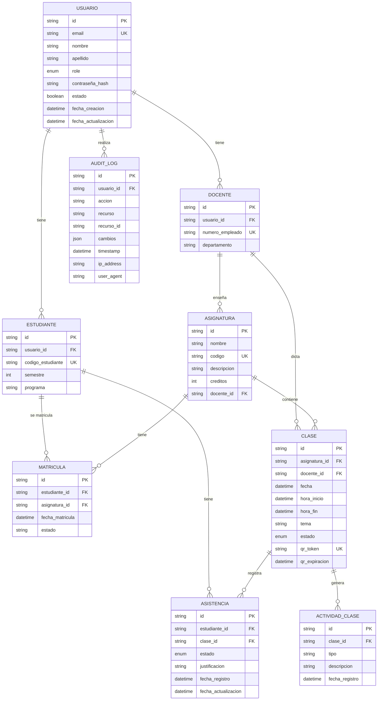
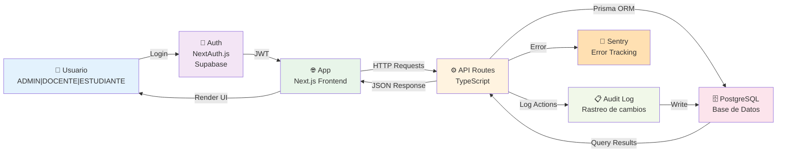

# Diagrama y Esquema de Base de Datos

**Sistema de Gestión Académica**

---

## 1. Diagrama Entidad-Relación (ER)



---

## 2. Esquema SQL Completo

### 2.1 Tabla `users`

```sql
CREATE TABLE users (
    id VARCHAR(255) PRIMARY KEY DEFAULT gen_random_uuid()::text,
    email VARCHAR(255) UNIQUE NOT NULL,
    nombre VARCHAR(100) NOT NULL,
    apellido VARCHAR(100) NOT NULL,
    role VARCHAR(20) NOT NULL CHECK (role IN ('ADMIN', 'DOCENTE', 'ESTUDIANTE')),
    contraseña_hash VARCHAR(255) NOT NULL,
    estado BOOLEAN DEFAULT true,
    fecha_creacion TIMESTAMP DEFAULT CURRENT_TIMESTAMP,
    fecha_actualizacion TIMESTAMP DEFAULT CURRENT_TIMESTAMP
);

CREATE INDEX idx_users_email ON users(email);
CREATE INDEX idx_users_role ON users(role);
CREATE INDEX idx_users_estado ON users(estado);
```

### 2.2 Tabla `docentes`

```sql
CREATE TABLE docentes (
    id VARCHAR(255) PRIMARY KEY DEFAULT gen_random_uuid()::text,
    usuario_id VARCHAR(255) UNIQUE NOT NULL,
    numero_empleado VARCHAR(50) UNIQUE NOT NULL,
    departamento VARCHAR(100),
    fecha_creacion TIMESTAMP DEFAULT CURRENT_TIMESTAMP,

    CONSTRAINT fk_docentes_usuario
        FOREIGN KEY (usuario_id)
        REFERENCES users(id)
        ON DELETE CASCADE
);

CREATE INDEX idx_docentes_usuario_id ON docentes(usuario_id);
CREATE INDEX idx_docentes_numero_empleado ON docentes(numero_empleado);
```

### 2.3 Tabla `estudiantes`

```sql
CREATE TABLE estudiantes (
    id VARCHAR(255) PRIMARY KEY DEFAULT gen_random_uuid()::text,
    usuario_id VARCHAR(255) UNIQUE NOT NULL,
    codigo_estudiante VARCHAR(50) UNIQUE NOT NULL,
    semestre INT NOT NULL CHECK (semestre > 0),
    programa VARCHAR(100),
    fecha_creacion TIMESTAMP DEFAULT CURRENT_TIMESTAMP,

    CONSTRAINT fk_estudiantes_usuario
        FOREIGN KEY (usuario_id)
        REFERENCES users(id)
        ON DELETE CASCADE
);

CREATE INDEX idx_estudiantes_usuario_id ON estudiantes(usuario_id);
CREATE INDEX idx_estudiantes_codigo ON estudiantes(codigo_estudiante);
CREATE INDEX idx_estudiantes_semestre ON estudiantes(semestre);
```

### 2.4 Tabla `asignaturas`

```sql
CREATE TABLE asignaturas (
    id VARCHAR(255) PRIMARY KEY DEFAULT gen_random_uuid()::text,
    nombre VARCHAR(255) NOT NULL,
    codigo VARCHAR(50) UNIQUE NOT NULL,
    descripcion TEXT,
    creditos INT NOT NULL CHECK (creditos > 0),
    docente_id VARCHAR(255) NOT NULL,
    fecha_creacion TIMESTAMP DEFAULT CURRENT_TIMESTAMP,

    CONSTRAINT fk_asignaturas_docente
        FOREIGN KEY (docente_id)
        REFERENCES docentes(id)
        ON DELETE RESTRICT
);

CREATE INDEX idx_asignaturas_codigo ON asignaturas(codigo);
CREATE INDEX idx_asignaturas_docente_id ON asignaturas(docente_id);
```

### 2.5 Tabla `matriculas`

```sql
CREATE TABLE matriculas (
    id VARCHAR(255) PRIMARY KEY DEFAULT gen_random_uuid()::text,
    estudiante_id VARCHAR(255) NOT NULL,
    asignatura_id VARCHAR(255) NOT NULL,
    fecha_matricula TIMESTAMP DEFAULT CURRENT_TIMESTAMP,
    estado VARCHAR(50) DEFAULT 'ACTIVA' CHECK (
        estado IN ('ACTIVA', 'SUSPENDIDA', 'COMPLETADA', 'CANCELADA')
    ),

    CONSTRAINT fk_matriculas_estudiante
        FOREIGN KEY (estudiante_id)
        REFERENCES estudiantes(id)
        ON DELETE CASCADE,

    CONSTRAINT fk_matriculas_asignatura
        FOREIGN KEY (asignatura_id)
        REFERENCES asignaturas(id)
        ON DELETE CASCADE,

    CONSTRAINT unique_matricula
        UNIQUE (estudiante_id, asignatura_id)
);

CREATE INDEX idx_matriculas_estudiante ON matriculas(estudiante_id);
CREATE INDEX idx_matriculas_asignatura ON matriculas(asignatura_id);
CREATE INDEX idx_matriculas_estado ON matriculas(estado);
```

### 2.6 Tabla `clases`

```sql
CREATE TABLE clases (
    id VARCHAR(255) PRIMARY KEY DEFAULT gen_random_uuid()::text,
    asignatura_id VARCHAR(255) NOT NULL,
    docente_id VARCHAR(255) NOT NULL,
    fecha DATE NOT NULL,
    hora_inicio TIMESTAMP NOT NULL,
    hora_fin TIMESTAMP NOT NULL,
    tema VARCHAR(255),
    estado VARCHAR(50) DEFAULT 'PROGRAMADA' CHECK (
        estado IN ('PROGRAMADA', 'EN_PROGRESO', 'FINALIZADA', 'CANCELADA')
    ),
    qr_token VARCHAR(255) UNIQUE,
    qr_expiracion TIMESTAMP,
    fecha_creacion TIMESTAMP DEFAULT CURRENT_TIMESTAMP,
    fecha_actualizacion TIMESTAMP DEFAULT CURRENT_TIMESTAMP,

    CONSTRAINT fk_clases_asignatura
        FOREIGN KEY (asignatura_id)
        REFERENCES asignaturas(id)
        ON DELETE CASCADE,

    CONSTRAINT fk_clases_docente
        FOREIGN KEY (docente_id)
        REFERENCES docentes(id)
        ON DELETE CASCADE,

    CONSTRAINT check_hora
        CHECK (hora_fin > hora_inicio)
);

CREATE INDEX idx_clases_asignatura ON clases(asignatura_id);
CREATE INDEX idx_clases_docente ON clases(docente_id);
CREATE INDEX idx_clases_fecha ON clases(fecha);
CREATE INDEX idx_clases_estado ON clases(estado);
CREATE INDEX idx_clases_qr_token ON clases(qr_token);
```

### 2.7 Tabla `asistencias`

```sql
CREATE TABLE asistencias (
    id VARCHAR(255) PRIMARY KEY DEFAULT gen_random_uuid()::text,
    estudiante_id VARCHAR(255) NOT NULL,
    clase_id VARCHAR(255) NOT NULL,
    estado VARCHAR(50) NOT NULL CHECK (
        estado IN ('PRESENTE', 'AUSENTE', 'TARDE', 'JUSTIFICADO')
    ),
    justificacion TEXT,
    fecha_registro TIMESTAMP DEFAULT CURRENT_TIMESTAMP,
    fecha_actualizacion TIMESTAMP DEFAULT CURRENT_TIMESTAMP,

    CONSTRAINT fk_asistencias_estudiante
        FOREIGN KEY (estudiante_id)
        REFERENCES estudiantes(id)
        ON DELETE CASCADE,

    CONSTRAINT fk_asistencias_clase
        FOREIGN KEY (clase_id)
        REFERENCES clases(id)
        ON DELETE CASCADE,

    CONSTRAINT unique_asistencia
        UNIQUE (estudiante_id, clase_id)
);

CREATE INDEX idx_asistencias_estudiante ON asistencias(estudiante_id);
CREATE INDEX idx_asistencias_clase ON asistencias(clase_id);
CREATE INDEX idx_asistencias_estado ON asistencias(estado);
CREATE INDEX idx_asistencias_fecha ON asistencias(fecha_registro);
```

### 2.8 Tabla `actividades_clase`

```sql
CREATE TABLE actividades_clase (
    id VARCHAR(255) PRIMARY KEY DEFAULT gen_random_uuid()::text,
    clase_id VARCHAR(255) NOT NULL,
    tipo VARCHAR(50) NOT NULL CHECK (
        tipo IN ('TEORÍA', 'PRÁCTICA', 'EVALUACIÓN', 'TALLER', 'LABORATORIO')
    ),
    descripcion TEXT NOT NULL,
    fecha_registro TIMESTAMP DEFAULT CURRENT_TIMESTAMP,

    CONSTRAINT fk_actividades_clase
        FOREIGN KEY (clase_id)
        REFERENCES clases(id)
        ON DELETE CASCADE
);

CREATE INDEX idx_actividades_clase ON actividades_clase(clase_id);
CREATE INDEX idx_actividades_tipo ON actividades_clase(tipo);
```

### 2.9 Tabla `audit_logs`

```sql
CREATE TABLE audit_logs (
    id VARCHAR(255) PRIMARY KEY DEFAULT gen_random_uuid()::text,
    usuario_id VARCHAR(255),
    accion VARCHAR(50) NOT NULL CHECK (
        accion IN ('CREATE', 'UPDATE', 'DELETE', 'READ')
    ),
    recurso VARCHAR(50) NOT NULL,
    recurso_id VARCHAR(255),
    cambios JSONB,
    timestamp TIMESTAMP DEFAULT CURRENT_TIMESTAMP,
    ip_address INET,
    user_agent TEXT,

    CONSTRAINT fk_audit_usuario
        FOREIGN KEY (usuario_id)
        REFERENCES users(id)
        ON DELETE SET NULL
);

CREATE INDEX idx_audit_usuario ON audit_logs(usuario_id);
CREATE INDEX idx_audit_recurso ON audit_logs(recurso);
CREATE INDEX idx_audit_timestamp ON audit_logs(timestamp);
CREATE INDEX idx_audit_accion ON audit_logs(accion);
```

---

## 3. Vistas SQL Útiles

### 3.1 Vista: Asistencia por Asignatura

```sql
CREATE OR REPLACE VIEW v_asistencia_por_asignatura AS
SELECT
    a.id,
    a.codigo,
    a.nombre,
    e.codigo_estudiante,
    u.nombre as estudiante_nombre,
    u.apellido,
    COUNT(CASE WHEN ast.estado = 'PRESENTE' THEN 1 END) as presentes,
    COUNT(CASE WHEN ast.estado = 'AUSENTE' THEN 1 END) as ausentes,
    COUNT(CASE WHEN ast.estado = 'TARDE' THEN 1 END) as tardanzas,
    COUNT(CASE WHEN ast.estado = 'JUSTIFICADO' THEN 1 END) as justificadas,
    COUNT(ast.id) as total_clases,
    ROUND(
        COUNT(CASE WHEN ast.estado = 'PRESENTE' THEN 1 END)::numeric /
        NULLIF(COUNT(ast.id), 0) * 100,
        2
    ) as porcentaje_asistencia
FROM asignaturas a
JOIN matriculas m ON a.id = m.asignatura_id
JOIN estudiantes e ON m.estudiante_id = e.id
JOIN users u ON e.usuario_id = u.id
LEFT JOIN clases c ON a.id = c.asignatura_id
LEFT JOIN asistencias ast ON c.id = ast.clase_id AND e.id = ast.estudiante_id
GROUP BY a.id, e.id, u.id, a.codigo, a.nombre, e.codigo_estudiante, u.nombre, u.apellido;
```

### 3.2 Vista: Desempeño de Docentes

```sql
CREATE OR REPLACE VIEW v_desempeño_docentes AS
SELECT
    d.id,
    u.nombre,
    u.apellido,
    COUNT(DISTINCT a.id) as total_asignaturas,
    COUNT(DISTINCT c.id) as total_clases,
    COUNT(DISTINCT m.estudiante_id) as estudiantes_totales,
    ROUND(AVG(
        COUNT(CASE WHEN ast.estado = 'PRESENTE' THEN 1 END)::numeric /
        NULLIF(COUNT(ast.id), 0) * 100
    ), 2) as promedio_asistencia
FROM docentes d
JOIN users u ON d.usuario_id = u.id
LEFT JOIN asignaturas a ON d.id = a.docente_id
LEFT JOIN clases c ON a.id = c.asignatura_id
LEFT JOIN matriculas m ON a.id = m.asignatura_id
LEFT JOIN asistencias ast ON c.id = ast.clase_id
GROUP BY d.id, u.id, u.nombre, u.apellido;
```

### 3.3 Vista: Alertas de Asistencia

```sql
CREATE OR REPLACE VIEW v_alertas_asistencia AS
SELECT
    a.id as asignatura_id,
    a.nombre as asignatura,
    e.codigo_estudiante,
    u.nombre || ' ' || u.apellido as estudiante_nombre,
    COUNT(ast.id) as total_clases,
    COUNT(CASE WHEN ast.estado = 'AUSENTE' THEN 1 END) as ausencias,
    ROUND(
        COUNT(CASE WHEN ast.estado = 'AUSENTE' THEN 1 END)::numeric /
        NULLIF(COUNT(ast.id), 0) * 100,
        2
    ) as porcentaje_ausencias,
    CASE
        WHEN COUNT(CASE WHEN ast.estado = 'AUSENTE' THEN 1 END)::numeric /
             NULLIF(COUNT(ast.id), 0) * 100 >= 30 THEN 'CRÍTICA'
        WHEN COUNT(CASE WHEN ast.estado = 'AUSENTE' THEN 1 END)::numeric /
             NULLIF(COUNT(ast.id), 0) * 100 >= 20 THEN 'ADVERTENCIA'
        ELSE 'OK'
    END as nivel_alerta
FROM asignaturas a
JOIN matriculas m ON a.id = m.asignatura_id
JOIN estudiantes e ON m.estudiante_id = e.id
JOIN users u ON e.usuario_id = u.id
JOIN clases c ON a.id = c.asignatura_id
JOIN asistencias ast ON c.id = ast.clase_id AND e.id = ast.estudiante_id
GROUP BY a.id, e.id, u.id, a.nombre, e.codigo_estudiante
HAVING COUNT(CASE WHEN ast.estado = 'AUSENTE' THEN 1 END)::numeric /
       NULLIF(COUNT(ast.id), 0) * 100 >= 20;
```

---

## 4. Consultas Útiles de Reporting

### 4.1 Reporte: Asistencia Global

```sql
SELECT
    DATE_TRUNC('week', c.fecha)::DATE as semana,
    COUNT(*) as total_registros,
    COUNT(CASE WHEN ast.estado = 'PRESENTE' THEN 1 END) as presentes,
    COUNT(CASE WHEN ast.estado = 'AUSENTE' THEN 1 END) as ausentes,
    COUNT(CASE WHEN ast.estado = 'TARDE' THEN 1 END) as tardanzas,
    ROUND(
        COUNT(CASE WHEN ast.estado = 'PRESENTE' THEN 1 END)::numeric /
        COUNT(*) * 100, 2
    ) as porcentaje_asistencia
FROM clases c
JOIN asistencias ast ON c.id = ast.clase_id
WHERE c.fecha >= CURRENT_DATE - INTERVAL '30 days'
GROUP BY DATE_TRUNC('week', c.fecha)
ORDER BY semana DESC;
```

### 4.2 Reporte: Estudiantes en Riesgo

```sql
SELECT
    e.codigo_estudiante,
    u.nombre || ' ' || u.apellido as estudiante,
    a.codigo || ' - ' || a.nombre as asignatura,
    COUNT(CASE WHEN ast.estado = 'PRESENTE' THEN 1 END) as presentes,
    COUNT(ast.id) as total_clases,
    ROUND(
        COUNT(CASE WHEN ast.estado = 'PRESENTE' THEN 1 END)::numeric /
        COUNT(ast.id) * 100, 2
    ) as porcentaje_asistencia
FROM estudiantes e
JOIN users u ON e.usuario_id = u.id
JOIN matriculas m ON e.id = m.estudiante_id
JOIN asignaturas a ON m.asignatura_id = a.id
JOIN clases c ON a.id = c.asignatura_id
JOIN asistencias ast ON c.id = ast.clase_id AND e.id = ast.estudiante_id
WHERE c.fecha >= CURRENT_DATE - INTERVAL '60 days'
GROUP BY e.id, u.id, a.id, e.codigo_estudiante, a.codigo, a.nombre
HAVING COUNT(CASE WHEN ast.estado = 'PRESENTE' THEN 1 END)::numeric /
       COUNT(ast.id) < 0.70
ORDER BY porcentaje_asistencia ASC;
```

### 4.3 Reporte: Actividades por Clase

```sql
SELECT
    c.id,
    a.codigo,
    a.nombre,
    c.fecha,
    c.hora_inicio,
    c.tema,
    STRING_AGG(DISTINCT ac.tipo, ', ') as actividades_SIGNEDs,
    COUNT(DISTINCT ac.id) as total_actividades,
    COUNT(DISTINCT m.estudiante_id) as estudiantes_esperados
FROM clases c
JOIN asignaturas a ON c.asignatura_id = a.id
JOIN matriculas m ON a.id = m.asignatura_id
LEFT JOIN actividades_clase ac ON c.id = ac.clase_id
WHERE c.estado = 'FINALIZADA'
GROUP BY c.id, a.id, a.codigo, a.nombre, c.fecha, c.hora_inicio, c.tema
ORDER BY c.fecha DESC;
```

---

## 5. Performance y Mantenimiento

### 5.1 Análisis de Índices

```sql
-- Ver índices existentes
SELECT
    schemaname,
    tablename,
    indexname,
    indexdef
FROM pg_indexes
WHERE schemaname = 'public'
ORDER BY tablename;

-- Ver fragmentación de índices
SELECT
    schemaname,
    tablename,
    indexname,
    idx_scan,
    idx_tup_read,
    idx_tup_fetch
FROM pg_stat_user_indexes
WHERE schemaname = 'public'
ORDER BY idx_scan DESC;
```

### 5.2 Mantenimiento

```sql
-- Vacuum y Analyze
VACUUM ANALYZE;

-- Reindex
REINDEX DATABASE sira_prod;

-- Ver tamaño de tablas
SELECT
    tablename,
    pg_size_pretty(pg_total_relation_size(schemaname||'.'||tablename)) AS size
FROM pg_tables
WHERE schemaname = 'public'
ORDER BY pg_total_relation_size(schemaname||'.'||tablename) DESC;
```

---

## 6. Diagrama Visual de Flujo de Datos



---

## 7. Estadísticas de Tablas

| Tabla | Registros Típicos | Crecimiento Anual |
|---|---|---|
| `users` | 100-1000 | Lineal (nuevos usuarios) |
| `docentes` | 20-100 | Bajo |
| `estudiantes` | 80-900 | Medio (cohortes) |
| `asignaturas` | 50-200 | Bajo |
| `matriculas` | 1K-10K | Medio (estudiantes × asignaturas) |
| `clases` | 5K-50K | Alto (clases por semestre) |
| `asistencias` | 50K-500K | Muy alto (estudiante × clase) |
| `actividades_clase` | 5K-50K | Medio |
| `audit_logs` | 100K-1M | Muy alto (todas las acciones) |

**Recomendación:** Archivar `audit_logs` más de 90 días en tabla separada

---

## 8. Backup y Recovery

### 8.1 Backup Completo

```bash
#!/bin/bash
# backup.sh

BACKUP_DIR="/backups"
DB_NAME="sira_prod"
TIMESTAMP=$(date +"%Y%m%d_%H%M%S")

# Crear backup con formato custom (comprimido)
pg_dump \
    --format=custom \
    --compress=9 \
    --file="$BACKUP_DIR/backup_$TIMESTAMP.dump" \
    $DATABASE_URL

echo "Backup creado: $TIMESTAMP"

# Subir a S3
aws s3 cp "$BACKUP_DIR/backup_$TIMESTAMP.dump" \
    s3://my-backups/sira/

# Limpiar backups locales > 7 días
find $BACKUP_DIR -name "backup_*.dump" -mtime +7 -delete
```

### 8.2 Recovery

```bash
#!/bin/bash
# restore.sh

BACKUP_FILE=$1

if [ -z "$BACKUP_FILE" ]; then
    echo "Uso: ./restore.sh <archivo_backup>"
    exit 1
fi

# Restore desde custom dump
pg_restore \
    --format=custom \
    --verbose \
    --file=/tmp/restore.sql \
    $BACKUP_FILE

# Ejecutar restauración
psql $DATABASE_URL < /tmp/restore.sql

echo "Restauración completada"
```

---

**Última actualización:** 2026-03-13
**Versión:** 1.0
