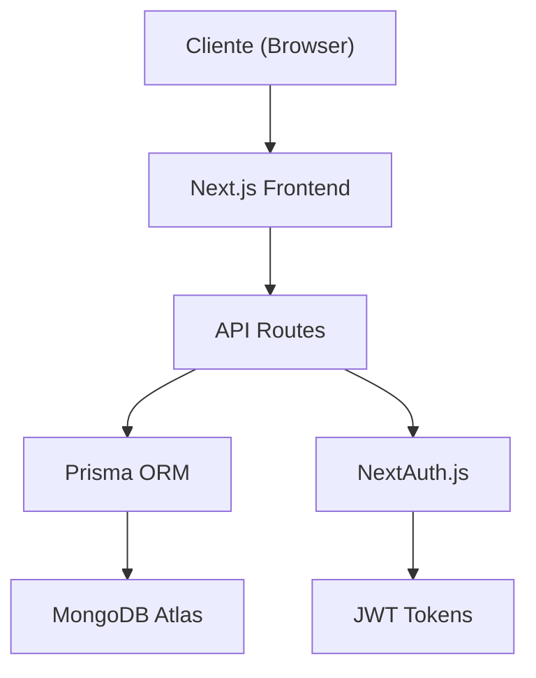

# 📚 Documentación del Sistema EduTrack

  <h2>Documentación Completa del Proyecto</h2>
  
Sistema de Gestión de Asistencias para la FUP

---

## 📖 Índice de Documentación

### 📋 **Documentos Principales**

1. **[Vista General del Proyecto](./01_PROJECT_OVERVIEW.md)**
   - Información del equipo y roles del sistema
   - Visión del producto y metodología

2. **[Especificación de la API](./02_API_SPECIFICATION.md)**
   - Endpoints y documentación técnica
   - Esquemas de datos y validaciones

3. **[Gestión del Proyecto](./03_PROJECT_MANAGEMENT.md)**
   - Metodología y planificación
   - Sprints y entregas

4. **[Documentación de Base de Datos](./04_DATABASE.md)**
   - Esquemas y relaciones
   - Migraciones y semillas
   - Índices y optimizaciones

5. **[Optimizaciones y Rendimiento](./05_OPTIMIZATIONS.md)**
   - Optimizaciones de queries
   - Sistema de caché Redis
   - Índices de base de datos
   - Optimización de componentes React

6. **[Estado del Proyecto](./06_PROJECT_STATUS.md)**
   - Análisis de completitud
   - Funcionalidades completadas y pendientes
   - Estimaciones de tiempo

7. **[Lista de Verificación](./07_COMPLETION_CHECKLIST.md)**
   - Tareas completadas
   - Tareas en progreso
   - Tareas pendientes

8. **[Resumen de Tareas Pendientes](./08_PENDING_TASKS_SUMMARY.md)**
   - Resumen ejecutivo de tareas pendientes
   - Plan de acción recomendado
   - Prioridades y tiempos estimados

9. **[Tareas Pendientes Detalladas](./PENDING_TASKS.md)**
   - Lista completa de tareas pendientes
   - Descripción detallada de cada tarea
   - Plan de implementación

10. **[Variables de Entorno](./ENV_VARIABLES.md)**
    - Configuración de variables de entorno
    - Configuración de Redis
    - Configuración de SMTP

11. **[Requisitos Funcionales y No Funcionales](./REQUIREMENTS.md)**
    - Especificación detallada de requisitos funcionales
    - Especificación de requisitos no funcionales
    - Prioridades y estado de implementación

---

## 🏗️ **Arquitectura del Sistema**

### Componentes Principales

- **Frontend**: Next.js 15 con React 19 y TypeScript
- **Backend**: API Routes de Next.js
- **Base de Datos**: MongoDB con Prisma ORM
- **Autenticación**: NextAuth.js con JWT
- **UI**: shadcn/ui + Tailwind CSS

### Flujo de Datos

---

## 📚 **Historias de Usuario y Épicas**

### **[Epic 1: Gestión de Usuarios](./user_stories/EPIC_01_USER_MANAGEMENT.md)** ✅ COMPLETADO

- Autenticación y autorización
- Gestión de roles y permisos
- Perfiles de usuario

### **[Epic 2: Gestión Académica](./user_stories/EPIC_02_ACADEMIC_MANAGEMENT.md)** ✅ COMPLETADO

- Administración de asignaturas
- Inscripción de estudiantes
- Gestión de programas académicos

### **[Epic 3: Programación de Clases](./user_stories/EPIC_03_CLASS_SCHEDULING.md)** ✅ COMPLETADO

- Creación y gestión de clases
- Horarios y calendario
- Notificaciones de clases

### **[Epic 4: Sistema QR](./user_stories/EPIC_04_QR_SYSTEM.md)** ✅ COMPLETADO

- Generación de códigos QR seguros
- Validación temporal
- Interfaz de escaneo

### **[Epic 5: Seguimiento de Asistencia](./user_stories/EPIC_05_ATTENDANCE_TRACKING.md)** ✅ COMPLETADO

- Registro automático vía QR
- Ajustes manuales
- Historial de asistencias

### **[Epic 6: Reportes y Analíticas](./user_stories/EPIC_06_REPORTS_ANALYTICS.md)** ✅ COMPLETADO

- Generación de reportes PDF
- Dashboard con métricas
- Exportación de datos

### **[Epic 7: Comunicaciones](./user_stories/EPIC_07_COMMUNICATION.md)** ✅ COMPLETADO

- ✅ Notificaciones por email (implementado)
- ✅ Sistema de plantillas personalizables
- ✅ Sistema de cola de correos con reintentos automáticos
- ✅ Configuración de preferencias de notificación

### **[Epic 8: Administración](./user_stories/EPIC_08_ADMINISTRATION.md)** ✅ COMPLETADO

- Panel de administración
- Carga masiva de datos
- Configuración del sistema

### **[Epic 9: Gestión de Aulas y Recursos](./user_stories/EPIC_09_CLASSROOM_MANAGEMENT.md)** ❌ NO IMPLEMENTADO

- Sistema de reserva de aulas (pendiente)
- Gestión de recursos tecnológicos (pendiente)
- Calendario de disponibilidad (pendiente)
- Panel de administración de solicitudes (pendiente)

---

## 📊 **Estado Actual del Proyecto**

### Funcionalidades Implementadas ✅

- **Autenticación completa** con roles y permisos
- **Panel administrativo** con gestión de usuarios
- **Sistema QR** con generación y validación segura
- **Dashboard** con analíticas en tiempo real
- **Reportes PDF** con firmas digitales
- **Carga masiva** de datos con validación
- **Sistema de caché Redis** para optimización de rendimiento
- **Optimización de queries** (eliminación de N+1 queries)
- **Índices de base de datos** para mejorar rendimiento
- **Separación de componentes** React para mejor mantenibilidad
- **Persistencia de tema** (modo oscuro/claro)
- **Invalidación automática de caché** cuando se actualizan datos
- **Sistema de notificaciones por email** con plantillas personalizables y cola de correos

### Optimizaciones de Rendimiento ✅

- **Caché Redis** con TTL de 5 minutos para dashboards
- **Reducción del 90%** en tiempo de respuesta (con caché)
- **Reducción del 80%** en requests al servidor
- **Reducción del 95%** en queries a la base de datos
- **Soporte para 200+ usuarios simultáneos**

Ver [Documentación de Optimizaciones](./05_OPTIMIZATIONS.md) para más detalles.

### En Desarrollo 🚧

- Testing automatizado completo (10% - pendiente)
- React Query para caché del lado del cliente (30% - hooks creados)
- Migración de formularios a react-hook-form (85% - 3 formularios pendientes)

### Pendiente ⏳

- Integración con calendario Outlook
- Módulo de backup automático
- Autenticación de dos factores (2FA)
- API pública documentada
- Webhooks y auditoría de acciones
- WebSockets/Server-Sent Events para actualizaciones en tiempo real
- Mejoras de UX/UI (animaciones, accesibilidad, i18n)

---

## 📋 **Documentos de Referencia**

1. **[Vista General del Proyecto](./01_PROJECT_OVERVIEW.md)** - Información del equipo y roles
2. **[Especificación de la API](./02_API_SPECIFICATION.md)** - Endpoints y documentación técnica
3. **[Gestión del Proyecto](./03_PROJECT_MANAGEMENT.md)** - Metodología y planificación
4. **[Documentación de Base de Datos](./04_DATABASE.md)** - Esquemas, relaciones e índices
5. **[Optimizaciones y Rendimiento](./05_OPTIMIZATIONS.md)** - Optimizaciones implementadas
6. **[Variables de Entorno](./ENV_VARIABLES.md)** - Configuración de variables de entorno

7. **[Estado del Proyecto](./06_PROJECT_STATUS.md)** - Análisis de completitud y tareas pendientes

8. **[Lista de Verificación](./07_COMPLETION_CHECKLIST.md)** - Lista de verificación para completar el proyecto

9. **[Resumen de Tareas Pendientes](./08_PENDING_TASKS_SUMMARY.md)** - Resumen ejecutivo de tareas pendientes

10. **[Tareas Pendientes Detalladas](./PENDING_TASKS.md)** - Lista completa de tareas pendientes con plan de implementación

11. **[Requisitos Funcionales y No Funcionales](./REQUIREMENTS.md)** - Especificación detallada de requisitos funcionales y no funcionales

---
