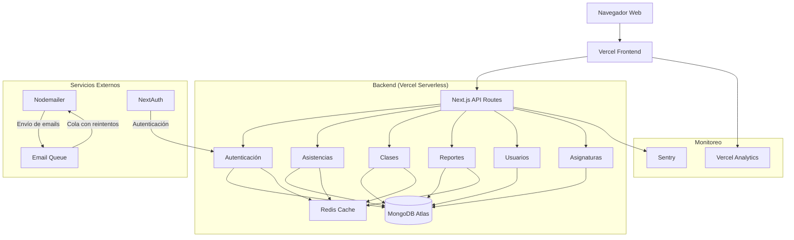

# Diagrama de Contenedores

```mermaid
graph TD
    A[Navegador Web] --> B[Vercel Frontend] --> C[Next.js API Routes]

    subgraph "Backend (Vercel Serverless)"
        C --> D[Autenticación]
        C --> E[Asistencias]
        C --> F[Clases]
        C --> G[Reportes]
        C --> H[Usuarios]
        C --> I[Asignaturas]

        D --> J[(MongoDB Atlas)]
        E --> J
        F --> J
        G --> J
        H --> J
        I --> J
        
        D --> K[Redis Cache]
        E --> K
        F --> K
        G --> K
    end

    subgraph "Servicios Externos"
        L[Nodemailer] -->|Envío de emails| M[Email Queue]
        M -->|Cola con reintentos| L
        N[NextAuth] -->|Autenticación| D
    end

    subgraph "Monitoreo"
        O[Vercel Analytics]
        P[Sentry]
    end

    B --> O
    C --> P
```
