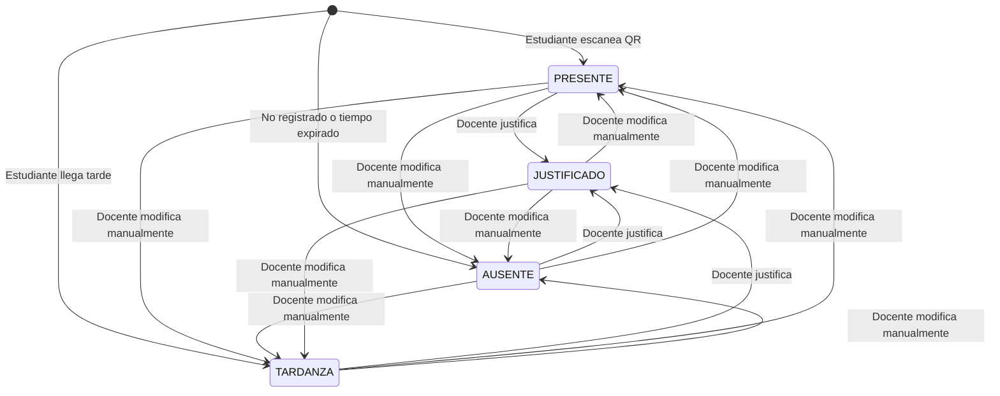

# Diagrama de Estados - Flujo de Asistencia

Este diagrama muestra los estados posibles de una asistencia según el enum `AttendanceStatus` definido en el schema de Prisma.

## Estados de Asistencia

- **PRESENTE**: El estudiante asistió a la clase
- **AUSENTE**: El estudiante no asistió a la clase
- **TARDANZA**: El estudiante llegó tarde a la clase
- **JUSTIFICADO**: La ausencia o tardanza fue justificada

## Diagrama de Estados

## Notas

- Los estados iniciales dependen de cómo se registra la asistencia (QR automático, registro manual del docente, etc.)
- Un docente puede modificar manualmente cualquier estado a otro estado válido
- Una vez justificada una asistencia, puede seguir siendo modificada por el docente si es necesario
