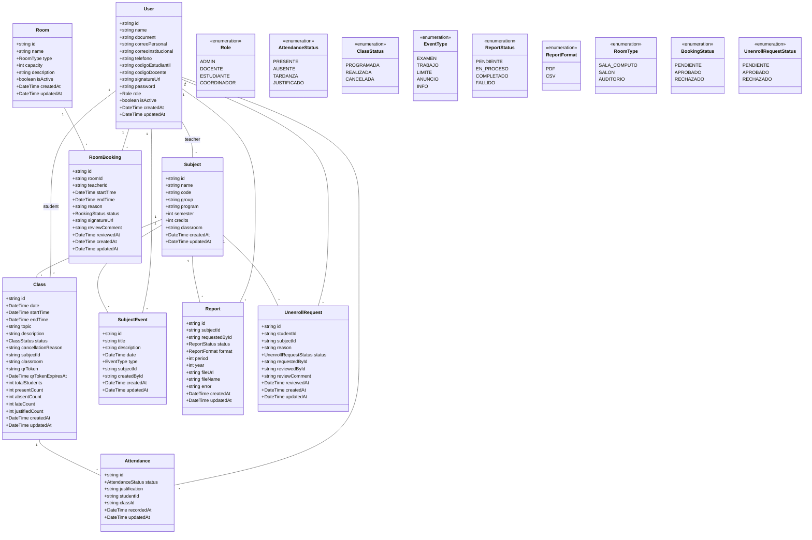
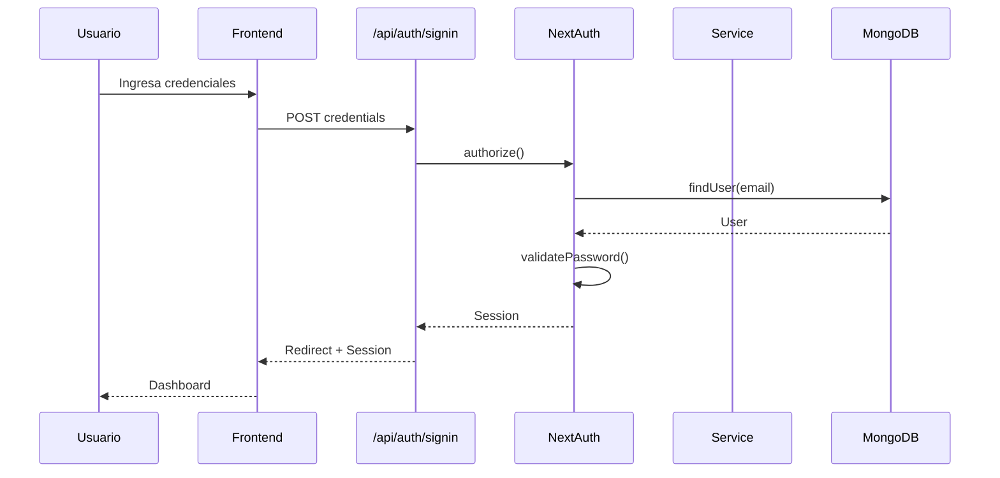
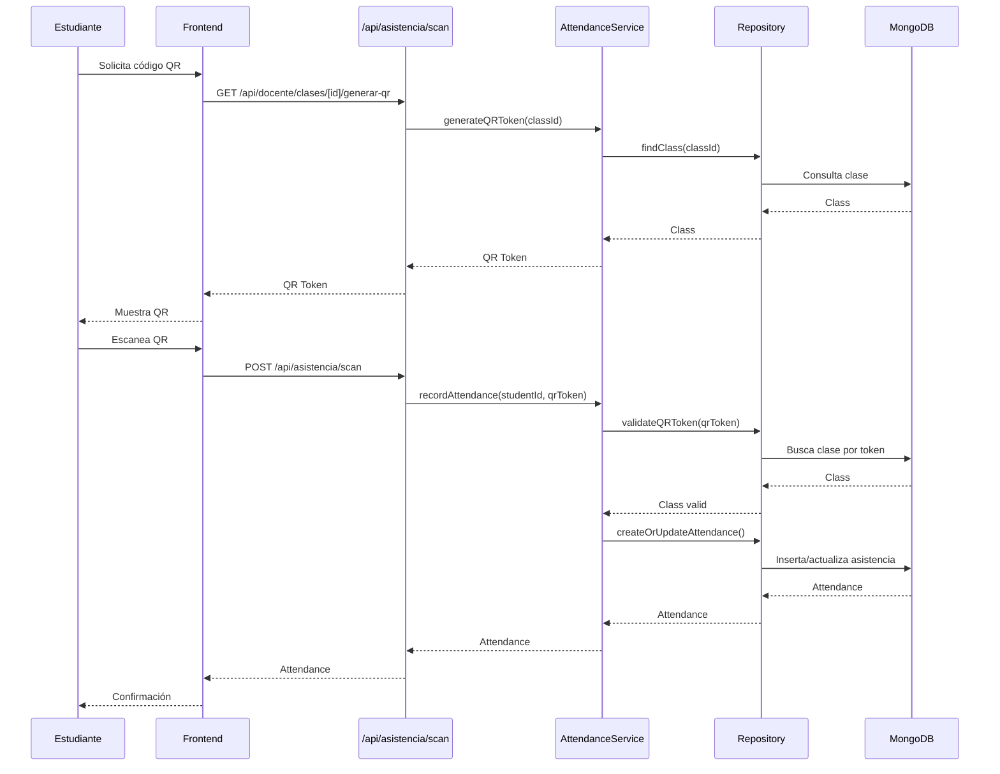
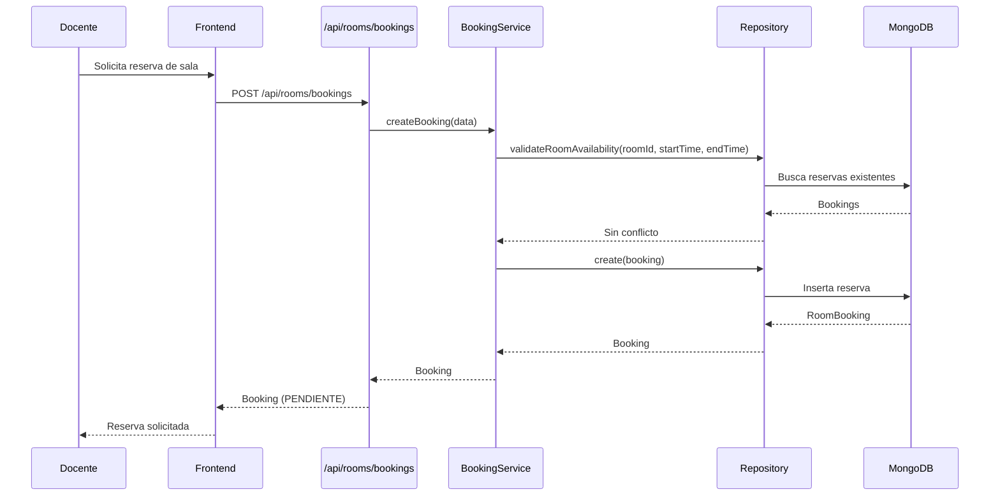
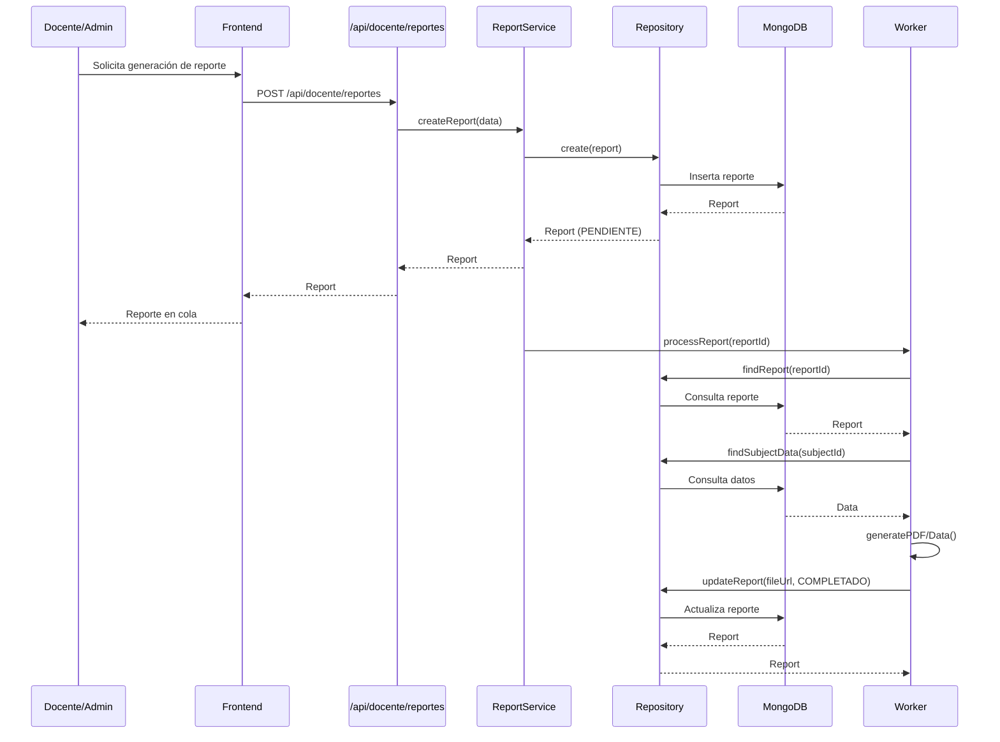
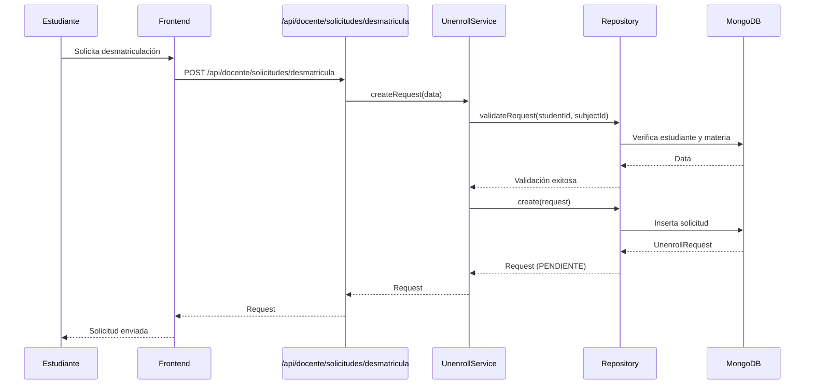

# Diagramas UML del Sistema de Gestión Académica

## 4.7.1. Diagrama de Casos de Uso

```mermaid
%%{init: {'theme': 'base', 'themeVariables': { 'primaryColor': '#4a90e2', 'edgeLabelBackground':'#ffffff', 'tertiaryColor': '#f0f8ff'}}}%%
flowchart TB
    subgraph Actores
        E["🎓 Estudiante"]
        D["👨‍🏫 Docente"]
        A["👨‍💼 Administrador"]
    end
    
    subgraph Casos_de_Uso
        direction TB
        
        %% Autenticación
        UC1["Iniciar Sesión"]
        UC2["Cerrar Sesión"]
        UC3["Recuperar Contraseña"]
        
        %% Gestión de Usuarios
        UC4["Gestionar Usuarios"]
        UC5["Buscar Usuarios"]
        UC6["Importar Usuarios"]
        
        %% Gestión Académica
        UC7["Gestionar Asignaturas"]
        UC8["Inscribir Estudiantes"]
        UC9["Gestionar Clases"]
        
        %% Asistencia
        UC10["Registrar Asistencia"]
        UC11["Escanear QR"]
        UC12["Justificar Ausencia"]
        
        %% Eventos
        UC13["Gestionar Eventos"]
        
        %% Reportes
        UC14["Generar Reportes"]
        UC15["Exportar Datos"]
        
        %% Salas
        UC16["Gestionar Salas"]
        UC17["Reservar Sala"]
        UC18["Aprobar Reserva"]
        
        %% Solicitudes
        UC19["Solicitar Desmatriculación"]
        UC20["Revisar Solicitudes"]
        
        %% Dashboard
        UC21["Ver Dashboard"]
    end
    
    E --> UC1
    E --> UC2
    E --> UC11
    E --> UC12
    E --> UC15
    E --> UC17
    E --> UC19
    E --> UC21
    
    D --> UC1
    D --> UC2
    D --> UC9
    D --> UC10
    D --> UC11
    D --> UC13
    D --> UC14
    D --> UC17
    D --> UC21
    
    A --> UC1
    A --> UC2
    A --> UC4
    A --> UC5
    A --> UC6
    A --> UC7
    A --> UC8
    A --> UC16
    A --> UC18
    A --> UC20
    A --> UC14
    A --> UC15
    A --> UC21

    style UC1 fill:#e3f2fd,stroke:#1976d2
    style UC2 fill:#e3f2fd,stroke:#1976d2
    style UC3 fill:#e3f2fd,stroke:#1976d2
    style UC4 fill:#e8f5e9,stroke:#388e3c
    style UC5 fill:#e8f5e9,stroke:#388e3c
    style UC6 fill:#e8f5e9,stroke:#388e3c
    style UC7 fill:#e8f5e9,stroke:#388e3c
    style UC8 fill:#e8f5e9,stroke:#388e3c
    style UC9 fill:#e8f5e9,stroke:#388e3c
    style UC10 fill:#fff3e0,stroke:#f57c00
    style UC11 fill:#fff3e0,stroke:#f57c00
    style UC12 fill:#fff3e0,stroke:#f57c00
    style UC13 fill:#fce4ec,stroke:#c2185b
    style UC14 fill:#f3e5f5,stroke:#7b1fa2
    style UC15 fill:#f3e5f5,stroke:#7b1fa2
    style UC16 fill:#e0f2f1,stroke:#00695c
    style UC17 fill:#e0f2f1,stroke:#00695c
    style UC18 fill:#e0f2f1,stroke:#00695c
    style UC19 fill:#ffebee,stroke:#c62828
    style UC20 fill:#ffebee,stroke:#c62828
    style UC21 fill:#eceff1,stroke:#455a64
```

**Ilustración X.** Diagrama de Casos de Uso - Sistema de Gestión Académica

---

## 4.7.2. Diagrama de Clases del Sistema

El diagrama de clases muestra la estructura de datos que sostiene este sistema, el cual está diseñado para gestionar la asistencia universitaria en tiempo real. Mediante un modelo de entidades conectadas, se registra desde la información de los participantes hasta el desarrollo de cada sesión académica, permitiendo que la lógica de negocio funcione de manera precisa entre usuarios, asignaturas, clases y registros de asistencia. Esta estructura, implementada en MongoDB con Prisma ORM, combina flexibilidad y rendimiento para soportar operaciones simultáneas a escala institucional.

```mermaid
classDiagram
    class User {
        +String id
        +String name
        +String document
        +String correoPersonal
        +String correoInstitucional
        +String telefono
        +String codigoEstudiantil
        +String codigoDocente
        +String signatureUrl
        +String password
        +Role role
        +Boolean isActive
        +DateTime createdAt
        +DateTime updatedAt
    }
    
    class Subject {
        +String id
        +String name
        +String code
        +String group
        +String program
        +Int semester
        +Int credits
        +String classroom
        +DateTime createdAt
        +DateTime updatedAt
    }
    
    class Class {
        +String id
        +DateTime date
        +DateTime startTime
        +DateTime endTime
        +String topic
        +String description
        +ClassStatus status
        +String cancellationReason
        +String subjectId
        +String classroom
        +String qrToken
        +DateTime qrTokenExpiresAt
        +Int totalStudents
        +Int presentCount
        +Int absentCount
        +Int lateCount
        +Int justifiedCount
    }
    
    class Attendance {
        +String id
        +AttendanceStatus status
        +String justification
        +String studentId
        +String classId
        +DateTime recordedAt
        +DateTime updatedAt
    }
    
    class SubjectEvent {
        +String id
        +String title
        +String description
        +DateTime date
        +EventType type
        +String subjectId
        +String createdById
    }
    
    class Report {
        +String id
        +String subjectId
        +String requestedById
        +ReportStatus status
        +ReportFormat format
        +Int period
        +Int year
        +String fileUrl
        +String fileName
    }
    
    class Room {
        +String id
        +String name
        +RoomType type
        +Int capacity
        +String description
        +Boolean isActive
    }
    
    class RoomBooking {
        +String id
        +String roomId
        +String teacherId
        +DateTime startTime
        +DateTime endTime
        +String reason
        +BookingStatus status
        +String signatureUrl
        +String reviewComment
        +DateTime reviewedAt
    }
    
    class UnenrollRequest {
        +String id
        +String studentId
        +String subjectId
        +String reason
        +UnenrollRequestStatus status
        +String requestedById
        +String reviewedById
        +String reviewComment
        +DateTime reviewedAt
    }
    
    class Role {
        <<enumeration>>
        +ADMIN
        +DOCENTE
        +ESTUDIANTE
        +COORDINADOR
    }
    
    class AttendanceStatus {
        <<enumeration>>
        +PRESENTE
        +AUSENTE
        +TARDANZA
        +JUSTIFICADO
    }
    
    class ClassStatus {
        <<enumeration>>
        +PROGRAMADA
        +REALIZADA
        +CANCELADA
    }
    
    class EventType {
        <<enumeration>>
        +EXAMEN
        +TRABAJO
        +LIMITE
        +ANUNCIO
        +INFO
    }
    
    class ReportStatus {
        <<enumeration>>
        +PENDIENTE
        +EN_PROCESO
        +COMPLETADO
        +FALLIDO
    }
    
    class ReportFormat {
        <<enumeration>>
        +PDF
        +CSV
    }
    
    class RoomType {
        <<enumeration>>
        +SALA_COMPUTO
        +SALON
        +AUDITORIO
    }
    
    class BookingStatus {
        <<enumeration>>
        +PENDIENTE
        +APROBADO
        +RECHAZADO
    }
    
    class UnenrollRequestStatus {
        <<enumeration>>
        +PENDIENTE
        +APROBADO
        +RECHAZADO
    }
    
    User "1" -- "*" Subject : imparte
    Subject "1" -- "*" Class : tiene
    Subject "1" -- "*" SubjectEvent : incluye
    Subject "1" -- "*" Report : genera
    Subject "1" -- "*" UnenrollRequest : recibe
    Class "1" -- "*" Attendance : registra
    User "1" -- "*" Attendance : tiene
    User "1" -- "*" SubjectEvent : crea
    User "1" -- "*" Report : solicita
    User "1" -- "*" RoomBooking : reserva
    User "1" -- "*" UnenrollRequest : solicita
    Room "1" -- "*" RoomBooking : tiene
    User ..> Role : usa
    Attendance ..> AttendanceStatus : usa
    Class ..> ClassStatus : usa
    SubjectEvent ..> EventType : usa
    Report ..> ReportStatus : usa
    Report ..> ReportFormat : usa
    Room ..> RoomType : usa
    RoomBooking ..> BookingStatus : usa
    UnenrollRequest ..> UnenrollRequestStatus : usa
```

**Ilustración X.** Diagrama de Clases del Sistema de Gestión de Asistencia Universitaria

---

## 4.7.3. Diagrama de Clases Detallado

**Ilustración X.** Diagrama de Clases - Sistema de Gestión Académica

---

## 4.7.4. Diagrama de Componentes

El sistema fue desarrollado utilizando una arquitectura monolítica de 4 capas, donde cada capa cumple un rol específico en el procesamiento de las solicitudes. La Capa de Presentación, construida con Next.js y React, gestiona la interacción con el usuario final. La Capa de Aplicación actúa como intermediario entre el frontend y la lógica de negocio, manejando las rutas de API, autenticación y validación de datos. La Capa de Lógica de Negocio contiene los servicios, reglas de dominio y validadores que procesan la información. Finalmente, la Capa de Acceso a Datos, implementada con Prisma ORM y MongoDB, gestiona la persistencia de toda la información del sistema.

```mermaid
flowchart LR
    subgraph PRESENT["CAPA DE PRESENTACIÓN"]
        direction TB
        P1["Next.js App Router"]
        P2["React Components"]
        P3["Pages /app"]
        P4["Custom Hooks"]
        P5["Context API"]
        P6["UI Library"]
    end
    
    subgraph APPLICATION["CAPA DE APLICACIÓN"]
        direction TB
        A1["API Routes<br/>/app/api/*"]
        A2["Route Handlers"]
        A3["Middleware Auth"]
        A4["NextAuth.js"]
        A5["Zod Validation"]
        A6["Request/Response"]
    end
    
    subgraph BUSINESS["CAPA DE LÓGICA DE NEGOCIO"]
        direction TB
        B1["Services<br/>/services/*"]
        B2["Business Rules"]
        B3["Validators"]
        B4["DTOs/Types"]
        B5["Utilities"]
        B6["Error Handling"]
    end
    
    subgraph DATA["CAPA DE ACCESO A DATOS"]
        direction TB
        D1["Prisma Client"]
        D2["Repositories"]
        D3["Data Models"]
        D4["MongoDB Database"]
        D5["Schema.prisma"]
    end
    
    subgraph EXTERNAL["SERVICIOS EXTERNOS"]
        direction TB
        E1["NextAuth Providers"]
        E2["Email Service"]
    end
    
    PRESENT --> APPLICATION
    APPLICATION --> BUSINESS
    BUSINESS --> DATA
    
    PRESENT -.->|"HTTP/REST"| APPLICATION
    APPLICATION -.->|"JWT/Session"| EXTERNAL
    BUSINESS -->|"Queries"| DATA
    EXTERNAL -.->|"OAuth/Email"| APPLICATION
    
    style PRESENT fill:#e3f2fd,stroke:#1976d2,stroke-width:2px
    style APPLICATION fill:#e8f5e9,stroke:#388e3c,stroke-width:2px
    style BUSINESS fill:#fff3e0,stroke:#f57c00,stroke-width:2px
    style DATA fill:#fce4ec,stroke:#c2185b,stroke-width:2px
    style EXTERNAL fill:#ede7f6,stroke:#5e35b1,stroke-width:2px
```

**Ilustración X.** Diagrama de Componentes - Arquitectura del Sistema

---

## 4.7.5. Diagramas de Secuencia

### 4.7.5.1. Inicio de Sesión

**Ilustración X.** Secuencia de Inicio de Sesión

### 4.7.5.2. Registro de Asistencia por QR

**Ilustración X.** Secuencia de Registro de Asistencia por QR

### 4.7.5.3. Reserva de Sala

**Ilustración X.** Secuencia de Reserva de Sala

### 4.7.5.4. Generación de Reportes

**Ilustración X.** Secuencia de Generación de Reportes

### 4.7.5.5. Solicitud de Desmatriculación

**Ilustración X.** Secuencia de Solicitud de Desmatriculación
